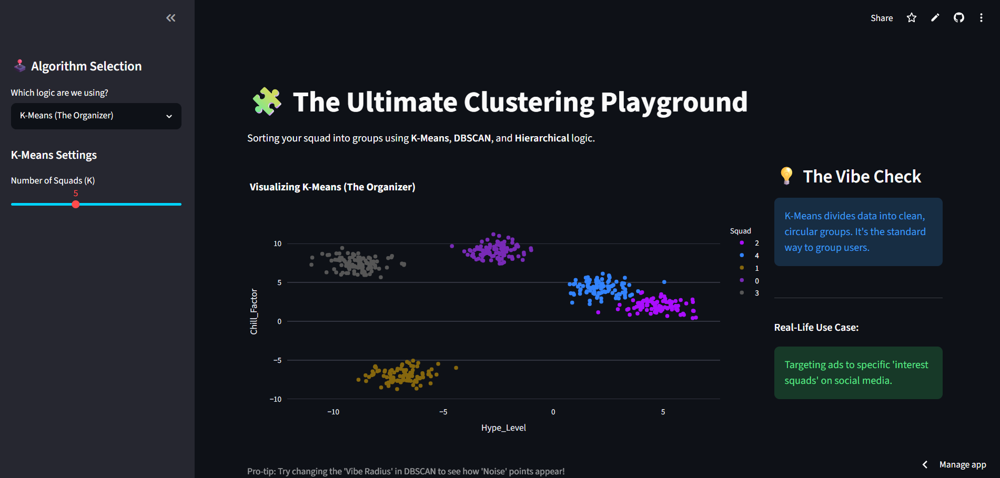
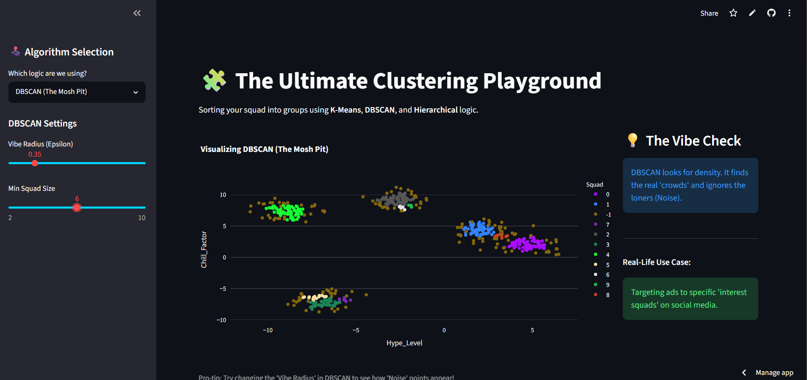
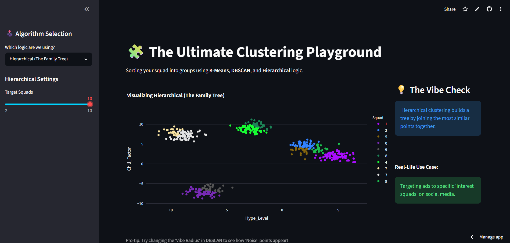

# 🧩 Ultimate Clustering Playground — ML Clustering Dashboard

## An Interactive ML Dashboard for Exploring Clustering Algorithms

[](https://python.org)
[](https://streamlit.io)
[](https://scikit-learn.org)
[](https://plotly.com)
[](https://ml-clustering-npt5ms4wcpjtvbqgigkwmr.streamlit.app/)

Welcome to the official repository for **Ultimate Clustering Playground** — an interactive, beginner-friendly Streamlit dashboard that lets you explore **K-Means**, **DBSCAN**, and **Hierarchical** clustering algorithms with a fun, GenZ-themed interface. This project is designed to make Machine Learning clustering concepts visual and intuitive.

> [!NOTE]
> 💡 **A Note from the Author:**
> I built this project to make ML clustering algorithms more approachable and fun. It uses synthetic "Hype Level" vs "Chill Factor" data to demonstrate how different clustering algorithms group data points. This was built using **Generative AI** tools as a way to learn how modern AI can accelerate development while creating something genuinely useful for ML learners.

---

## 🛠️ Technology Stack

This application is built using a modern Python data stack:

- **Python** ([main.py](py/main.py)): Core application logic with structured Streamlit app architecture.
- **Streamlit**: Interactive web UI framework with sidebar controls, column layouts, and real-time plotting.
- **scikit-learn**: ML engine powering K-Means, DBSCAN, and Agglomerative Clustering.
- **Plotly**: Interactive scatter plot visualizations with dark theme and color-coded clusters.
- **Pandas & NumPy**: Data generation, manipulation, and session state management.

---

## 🌟 Key Features

1. **Three Clustering Algorithms**:
   - **K-Means (The Organizer)**: Clean, circular group partitioning with adjustable K (2–10).
   - **DBSCAN (The Mosh Pit)**: Density-based clustering with configurable "Vibe Radius" and minimum squad size.
   - **Hierarchical (The Family Tree)**: Agglomerative clustering with adjustable target squads.
2. **Interactive Controls**:
   - **Sidebar Panel**: Algorithm selection and real-time parameter sliders.
   - **Live Visualizations**: Plotly scatter plots that update instantly on parameter changes.
3. **Educational Design**:
   - **Vibe Check Panel**: Explains how each algorithm works in plain English.
   - **Real-Life Use Case**: Connects clustering to practical applications like ad targeting.

---

## 📸 Screen Gallery

Check out the clustering dashboard in action:

| 🎮 Main Dashboard | 🕹️ Sidebar Controls |
| :---: | :---: |
|  |  |

| 📊 Clustering Visualization |
| :---: |
|  |

---

## 🚀 Live Deployment

The application is deployed and publicly accessible online:
🔗 **[Visit Ultimate Clustering Playground](https://ml-clustering-npt5ms4wcpjtvbqgigkwmr.streamlit.app/)**

> [!WARNING]
> **Note:** The live app may be in sleep mode due to inactivity. If it doesn't load immediately, just wait a few seconds — or ping me on my socials (below) to wake it up! 🚀

---

## ⚙️ How to Run Locally

If you want to run the clustering dashboard locally, follow these instructions:

1. **Clone the Repository**:
   ```bash
   git clone https://github.com/AniketDaiya/ml-clustering.git
   ```
2. **Navigate to the Project Directory**:
   ```bash
   cd ml-clustering
   ```
3. **Install Dependencies**:
   ```bash
   pip install -r requirements.txt
   ```
4. **Run the Application**:
   ```bash
   streamlit run py/main.py
   ```
   Then, open `http://localhost:8501` in your web browser.

---

## 🐛 Bugs & Troubleshooting (For Developers)

- **Windows ConnectionResetError**: On Python 3.14+ for Windows, the app includes `asyncio.set_event_loop_policy(asyncio.WindowsSelectorEventLoopPolicy())` in [main.py](py/main.py) to prevent `ConnectionResetError`. If you encounter this on other platforms, file an issue.
- **Streamlit Version Compatibility**: Ensure Streamlit >= 1.28. If the layout breaks, upgrade with `pip install --upgrade streamlit`.
- **Data Regeneration**: The app generates random blob data on first load. Each session restart creates a new dataset, so cluster patterns will vary.

---

## ⚠️ Known Limitations & Architecture

Please note the following technical constraints for this version of the project:

- **Synthetic Data Only**: The app uses `make_blobs()` to generate synthetic data. It does not accept real CSV or database uploads.
- **No Persistent State**: All data is ephemeral — refreshing the page regenerates the dataset. No database backend.
- **No Authentication**: There is no login, user tracking, or multi-user support.
- **Streamlit Hosting**: The live deployment runs on Streamlit Community Cloud, which may sleep after periods of inactivity.

> [!IMPORTANT]
> **Looking for More?**
> This project was built using **Generative AI tools** as a learning experiment. If you're interested in contributing additional algorithms (Gaussian Mixture Models, OPTICS, BIRCH) or features (CSV upload), feel free to open an issue or pull request!

---

## 🤝 Let's Connect & Be Friends!

I built this as a fun way to make ML clustering concepts accessible. I'd love to connect, get your feedback, and collaborate!

- **GitHub**: [@AniketDaiya](https://github.com/AniketDaiya) 🚀
- **LinkedIn**: [in/aniket-daiya-1473b93a3](https://www.linkedin.com/in/aniket-daiya-1473b93a3/) 💼

*Thank you for visiting my project! If you found this helpful, feel free to give the repository a ⭐️!*
